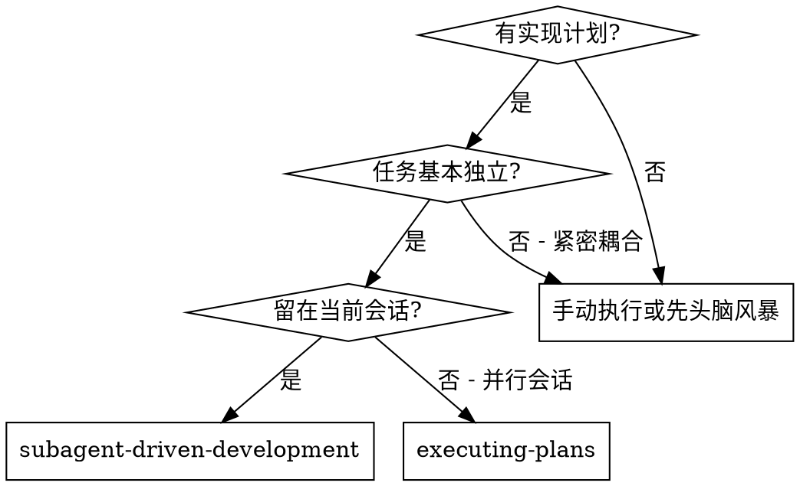
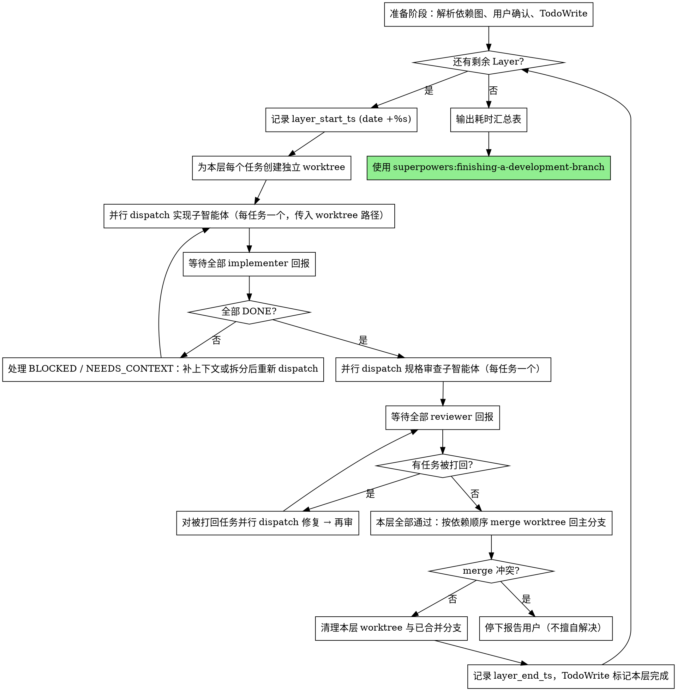

# 子智能体驱动开发

通过为每个任务分派一个全新的子智能体来执行计划，每个任务完成后只进行规格合规性审查。

**为什么用子智能体：** 你将任务委派给具有隔离上下文的专用智能体。通过精心设计它们的指令和上下文，确保它们专注并成功完成任务。它们不应继承你的会话上下文或历史记录——你要精确构造它们所需的一切。这样也能为你自己保留用于协调工作的上下文。

**核心原则：** 每个任务一个全新子智能体 + 规格合规性审查 = 更快的计划执行

## 何时使用



**与 Executing Plans（并行会话）的对比：**
- 同一会话（无上下文切换）
- 每个任务全新子智能体（无上下文污染）
- 每个任务后做规格合规性审查
- 同层独立任务并行 dispatch（按计划的依赖图分层）
- 更快的迭代（任务间无需人工介入）

## 准备阶段

执行任何任务之前，必须先把计划里的依赖图解析成可执行的分层方案。这一步只做一次。

**步骤：**

1. **读取计划**，一次性提取所有任务的完整文本、`touches`、`depends_on`
2. **校验字段完整性**：每个任务都必须有 `touches` 和 `depends_on`。如果有遗漏，停下报告用户，请求回到 writing-plans 补全——不要自己脑补依赖关系
3. **把 touches 冲突转成伪依赖**：对每对任务 (A, B)，如果它们的 `touches` 文件集相交且彼此无 `depends_on` 关系，按任务编号给较晚的那个加一条伪依赖（B 的 depends_on 增加 A）。这样分层只看依赖图就够了
4. **构建分层并行图**：
   - Layer 0 = 所有 `depends_on: 无` 的任务
   - Layer N = 所有依赖只在 Layer 0..N-1 中的任务
5. **向用户展示分层方案，请求确认**：

   ```
   分层并行计划：

   Layer 0（并行）:
     ‖ 任务 1 [src/a.ts]
     ‖ 任务 2 [src/b.ts]
   Layer 1（依赖 Layer 0）:
     ‖ 任务 3 [src/c.ts]
     ‖ 任务 4 [src/d.ts]
   Layer 2（任务 5 与任务 1 文件冲突，被推后）:
     ‖ 任务 5 [src/a.ts]

   预计提速：5 串行 → 3 层 ≈ 1.7x（实际取决于各任务耗时）
   ```

   等待用户确认后才开始执行。

6. **创建 TodoWrite**，按层组织任务

**为什么需要用户确认：** 自动解析依赖图基于计划标注，但标注可能有遗漏或错标。用户在执行前看一眼方案，是廉价但高价值的一道闸门，避免并行翻车。

## 流程



**关于问答阶段：** 由于同层多任务并行，implementer 不再有"开工前提问"的同步窗口。控制者必须在 dispatch 之前就把任务上下文写得足够完整——任何 implementer 在工作中卡住，统一以 NEEDS_CONTEXT 状态回报，控制者补完上下文后重新 dispatch。这要求计划本身的质量更高。

## 并行 dispatch 协议（最关键）

**控制者最容易犯的错：嘴上说"并行"，工具调用一次只发一个。** 这是 Claude 的默认行为倾向（一次一个工具、看返回、再决定下一步），会让本技能的提速效果完全失效——本层 N 个任务被串行成 N 倍时间。光在文档里写"必须并行"治不好，模型会读到、会复述、会在事后承认错了，但下一轮还是单发。

**强制自检（每次 dispatch 前都做）：** 在 assistant message 中先写出这两行 plain text，再调用工具：

```
本层待 dispatch：N 个任务（任务 A、B、C…）
本条消息将包含：N 个 Agent tool use block
```

写完之后生成工具调用时**必须凑够 N 个**。implementer / reviewer / 修复 dispatch 都按这个协议走。如果你发现自己只想发 1 个工具调用，停下——重读上面那两行，然后一次性把 N 个 Agent tool use 全部写在同一条消息里。

**绝不：**
- 发 1 个 Agent，等返回，再发下一个（这就是串行）
- 用"先看看第一个怎么样"或"稳一点逐个来"作为分批发送的理由——本技能就是为同时启动设计的，逐个来等于不用本技能
- 在 reviewer 阶段松懈成单发（reviewer 的并行同样关键，不要因为"审查比实现轻"就退化）

## 反模式 vs 正确形态

**❌ 反模式（来自真实失败日志）：**

```
消息 1：[narration "并行 dispatch 4 个 implementer"]
        Agent(任务 1)                          ← 只发了 1 个
[等待 task 1 完成]
消息 2：[narration "我犯了个错，应该并行"]
        Agent(任务 2)                          ← 又只发了 1 个
[等待 task 2 完成]
消息 3：[narration "并行 dispatch 剩余两个"]
        Agent(任务 3)                          ← 还是只发了 1 个
... 5 次 dispatch 全单发，零次并行 ...
```

每条消息都在 narration 里"承诺并行"，但工具调用还是一次一个。这是本技能最大的威胁——必须靠上一节的强制自检拦住。

**✅ 正确形态：**

```
消息 1：[narration "本层 4 个任务，本条消息包含 4 个 Agent tool use"]
        Agent(任务 1, worktree=.../task-1)
        Agent(任务 2, worktree=.../task-2)
        Agent(任务 3, worktree=.../task-3)
        Agent(任务 5, worktree=.../task-5)
[一次性等 4 个 implementer 全部返回]
```

一条 assistant message 包含本层全部 N 个 Agent tool use，顺序无所谓，全部同时启动。reviewer 阶段同理。

## 模型选择

使用能胜任每个角色的最低成本模型，以节省开支并提高速度。

**机械性实现任务**（隔离的函数、清晰的规格、1-2 个文件）：使用快速、便宜的模型。当计划编写得足够详细时，大多数实现任务都是机械性的。

**集成和判断类任务**（多文件协调、模式匹配、调试）：使用标准模型。

**架构、设计和规格审查类任务**：使用最强的可用模型。

**任务复杂度信号：**
- 涉及 1-2 个文件且有完整规格 → 便宜模型
- 涉及多个文件且有集成考虑 → 标准模型
- 需要设计判断或广泛的代码库理解 → 最强模型

## 处理实现者状态

实现子智能体报告四种状态之一。根据每种状态进行相应处理：

**DONE：** 进入规格合规性审查。

**DONE_WITH_CONCERNS：** 实现者完成了工作但标记了疑虑。在继续之前阅读这些疑虑。如果疑虑涉及正确性或范围，在审查前解决。如果只是观察性说明（如"这个文件越来越大了"），记录下来并继续审查。

**NEEDS_CONTEXT：** 实现者需要未提供的信息。提供缺失的上下文并重新分派。

**BLOCKED：** 实现者无法完成任务。评估阻塞原因：
1. 如果是上下文问题，提供更多上下文并用同一模型重新分派
2. 如果任务需要更强的推理能力，用更强的模型重新分派
3. 如果任务太大，拆分为更小的部分
4. 如果计划本身有问题，上报给人类

**绝不** 忽略上报或在不做任何更改的情况下让同一模型重试。如果实现者说卡住了，说明有什么东西需要改变。

**并行场景下的处理：**
- 同层多个 implementer 可能同时回报不同状态。**等所有 implementer 都回来再处理**——不要因为一个回报快就提前推进
- 全部 DONE 才进入审查阶段；任何任务还在 BLOCKED / NEEDS_CONTEXT，先解决再统一进审查
- 同层只有部分任务被打回时，仅对被打回的任务并行 dispatch 修复，其他已通过的任务不动
- 整层都通过审查后才能 merge——不允许"先 merge 已通过的，剩下慢慢修"，否则后续任务的 worktree 会基于不同的主干状态，破坏并行的隔离前提

## merge 与清理

本层全部通过审查后，按依赖顺序把 worktree 上的任务分支 merge 回主分支，**merge 完立刻清理对应的 worktree 和分支**——它们已经完成使命，留下来只会堆积成垃圾（10 任务 = 10 个目录 + 10 个分支）。

**对本层每个任务依次执行：**

```bash
# 1. 切回主分支并 merge
git checkout <main-branch>          # 例如 refactory-xml
git merge --no-ff <task-branch>     # 例如 task-1-popconfirm

# 2. merge 成功后立刻清理
git worktree remove <worktree-path>     # 例如 ../ai-video-task-1
git branch -d <task-branch>             # 用 -d 不用 -D
```

**为什么用 `-d` 而不是 `-D`：** `-d` 会让 git 自检"这个分支是否已合并到当前 HEAD"，没合并就拒绝删——这是安全网，万一某个任务因为冲突没真正进主分支但分支被强删，commit 就丢了。如果 `-d` 报错，停下查清楚为什么没合并，**绝不**用 `-D` 强删绕过。

**merge 冲突时：** 停下报告用户（不擅自解决），暂时不要清理这个 worktree。冲突解决并 merge 完成后再清理。

**绝不：**
- merge 完不清理（worktree 和分支堆积是 SDD 跑多层后最常见的脏环境）
- 用 `git branch -D` 强删未合并的分支
- 在 worktree 里直接 `rm -rf` 删目录（必须用 `git worktree remove` 让 git 同步元数据）
- 跨层延后清理（"等所有 layer 跑完一起清"——出错时定位困难，且占用磁盘）

## 耗时统计

由于同层任务在墙钟时间上是并行发生的，**以"层"为单位记录耗时才能反映用户真实感受到的等待时间**。单独累计每个任务的耗时会重复计入并失真。

**控制者协议（层级）：**

1. 进入一层之前，运行 `date +%s` 拿到 `layer_start_ts`
2. 初始化本层的子智能体计数器：`layer_agent_calls = 0`
3. 每分派一次 implementer / reviewer / 修复子智能体，计数器 `+1`（不论是哪个任务）
4. 本层全部 merge 回主分支**并清理 worktree / 分支**之后，运行 `date +%s` 拿到 `layer_end_ts`（清理也算本层耗时——merge + 清理才是工作的真正结束）
5. 计算 `layer_duration = layer_end_ts - layer_start_ts`，立即向用户简报：`Layer N 完成，耗时 Xm Ys（K 个并行任务，Z 次子智能体调用）`
6. 在内存中维护 `[(layer_id, [task_names], duration, agent_calls), ...]` 列表

**所有 Layer 完成后：** 在交接给 `superpowers:finishing-a-development-branch` 之前，输出汇总表：

```
| Layer | 并行任务 | 耗时 | 子智能体次数 |
| --- | --- | --- | --- |
| 0 | 任务 1, 任务 2, 任务 3 | 4m 22s | 6（3 实现 + 3 审查） |
| 1 | 任务 4, 任务 5 | 6m 11s | 5（2 实现 + 2 审查 + 1 修复） |
| **总计** | **5 个任务** | **10m 33s** | **11** |
```

**为什么记录子智能体次数：** 单凭耗时无法区分"任务大"和"审查反复"。次数显著高于"任务数 × 2"说明规格不够清晰或任务拆得不够细，是后续优化计划的信号。

**格式细则：**
- 耗时小于 60 秒按 `Xs` 显示，1 分钟以上按 `Xm Ys`，1 小时以上按 `Xh Ym`
- 子智能体次数按"实现 + 审查 + 修复"分项计数，便于诊断瓶颈
- 如果某任务被中途阻塞，需要补上下文重新 dispatch，仍归入该层耗时；备注列说明
- 层只有一个任务时也按层记录，方便保持表格一致性

## 提示词模板

- `./implementer-prompt.md` - 分派实现子智能体
- `./spec-reviewer-prompt.md` - 分派规格合规审查子智能体

## 示例工作流

```
你：我正在使用子智能体驱动开发来执行这个计划。

[一次性读取计划文件：docs/superpowers/plans/feature-plan.md]
[提取全部 5 个任务的完整文本、touches、depends_on]

准备阶段：

[校验：5 个任务都有 touches 和 depends_on ✓]
[把 touches 冲突转成伪依赖：任务 5 与任务 1 都触及 src/cli/index.ts → 任务 5 加伪依赖任务 1]
[分层]:
  Layer 0: 任务 1, 任务 2, 任务 3（depends_on: 无）
  Layer 1: 任务 4（依赖任务 2）
  Layer 2: 任务 5（依赖任务 1，touches 冲突）

你：分层并行计划如下：

  Layer 0（并行）:
    ‖ 任务 1：Hook 安装脚本 [src/cli/install.ts, src/cli/index.ts, tests/install.test.ts]
    ‖ 任务 2：恢复模式 [src/cli/repair.ts, tests/repair.test.ts]
    ‖ 任务 3：日志格式化 [src/log.ts, tests/log.test.ts]
  Layer 1（依赖 Layer 0）:
    ‖ 任务 4：日志聚合 [src/aggregate.ts, tests/aggregate.test.ts]
  Layer 2（任务 5 与任务 1 文件冲突，被推后）:
    ‖ 任务 5：CLI 帮助文本 [src/cli/index.ts]

  预计：3 层 vs 5 串行（约 1.7x 提速，实际取决于任务耗时）。是否开始？

用户：开始

[创建 TodoWrite，按层组织 5 个任务]

═══ Layer 0 ═══

[date +%s → layer_start_ts=1715140800，layer_agent_calls=0]
[为任务 1/2/3 各创建一个 worktree：.worktrees/task-1, task-2, task-3]
[同一条消息中并行 dispatch 3 个 implementer，每个传入对应 worktree 路径 → layer_agent_calls=3]

[等待全部回报]
implementer-1：DONE - install 命令 + 测试 5/5 通过，已提交
implementer-2：DONE - repair 模式 + 测试 8/8 通过，已提交
implementer-3：DONE - 日志格式化 + 测试 4/4 通过，已提交

[同一条消息中并行 dispatch 3 个 reviewer → layer_agent_calls=6]
reviewer-1：✅ 符合规格
reviewer-2：❌ 缺失"每 100 项进度报告"，多余 --json 参数
reviewer-3：✅ 符合规格

[只对任务 2 dispatch 修复 → layer_agent_calls=7]
implementer-2：移除 --json，加上进度报告，已提交

[只对任务 2 dispatch reviewer → layer_agent_calls=8]
reviewer-2：✅ 现在符合规格

[本层全部通过，按依赖顺序 merge 回主分支并清理]
[merge task-1 ✓ → worktree remove + branch -d ✓]
[merge task-2 ✓ → worktree remove + branch -d ✓]
[merge task-3 ✓ → worktree remove + branch -d ✓]
[date +%s → layer_end_ts=1715141262，duration=462s=7m 42s]
[TodoWrite：任务 1, 2, 3 完成]
你：✅ Layer 0 完成，耗时 7m 42s（3 个并行任务，8 次子智能体调用：3 实现 + 3 审查 + 1 修复 + 1 复审）

═══ Layer 1 ═══

[date +%s → layer_start_ts=1715141265，layer_agent_calls=0]
[创建 worktree .worktrees/task-4，dispatch implementer → layer_agent_calls=1]
implementer-4：DONE
[dispatch reviewer → layer_agent_calls=2]
reviewer-4：✅
[merge task-4 ✓ → worktree remove + branch -d ✓]
[layer_end_ts=1715141525，duration=4m 20s]
你：✅ Layer 1 完成，耗时 4m 20s（1 个任务，2 次子智能体调用）

═══ Layer 2 ═══（略，单任务流程同 Layer 1）

[全部 Layer 完成后，输出汇总表]

| Layer | 并行任务 | 耗时 | 子智能体次数 |
| --- | --- | --- | --- |
| 0 | 任务 1, 任务 2, 任务 3 | 7m 42s | 8（3 实现 + 3 审查 + 1 修复 + 1 复审） |
| 1 | 任务 4 | 4m 20s | 2（1 实现 + 1 审查） |
| 2 | 任务 5 | 3m 15s | 2（1 实现 + 1 审查） |
| **总计** | **5 个任务** | **15m 17s** | **12** |

（参考：纯串行预计约 25-30m）

[交接给 superpowers:finishing-a-development-branch]

完成！
```

## 优势

**与手动执行相比：**
- 子智能体自然遵循 TDD
- 每个任务全新上下文（不会混淆）
- 同层并行 + worktree 隔离（子智能体不会互相干扰）

**与 Executing Plans 相比：**
- 同一会话（无交接）
- 持续进展（无需等待）
- 规格审查检查点自动化

**效率提升：**
- **分层并行是核心提速来源**：按依赖图把独立任务推到同一层并行 dispatch，墙钟时间 ≈ 各层最慢任务之和，而非所有任务串行之和
- 无文件读取开销（控制者提供完整文本）
- 控制者精确策划所需上下文
- 子智能体预先获得完整信息

**审查关卡：**
- 自审在交接前发现问题
- 规格合规性审查确保修复确实有效
- 规格合规防止过度/不足构建

**成本：**
- 更少子智能体调用（每个任务需要实现者 + 1 个审查者）
- 控制者需要更多准备工作（预先提取所有任务、解析依赖图、创建 worktree、merge）
- 规格审查循环仍会增加迭代次数
- 计划标注（touches / depends_on）质量直接决定并行效率
- 同层任务并行后失去"开工前提问"窗口，要求计划上下文更充分

## 红线

**绝不：**
- 未经用户明确同意就在 main/master 分支上开始实现
- 跳过准备阶段（不解析依赖图、不向用户确认就直接开干 = 并行翻车的最快路径）
- 跳过规格合规性审查
- 带着未修复的问题继续
- 跨层并行（不同 Layer 的任务必须串行；同层才能并行）
- 同层任务不并行（同层有多个任务时必须并行 dispatch，每个一个 worktree——这是本技能提速的核心）
- 把所有任务塞进同一个工作区（即使是同层并行也必须 worktree 隔离，否则文件会冲突）
- merge 冲突时擅自解决（停下报告用户，让人决定如何处理）
- merge 完不清理本层 worktree 和分支（每个任务 merge 后立刻 `git worktree remove` + `git branch -d`，详见"merge 与清理"章节）
- 用 `git branch -D` 强删未合并的分支（必须用 `-d`，让 git 自检合并状态）
- 让子智能体读取计划文件（应提供完整文本）
- 跳过场景铺设上下文（同层并行没有"开工前提问"窗口，上下文必须一次给足）
- 忽视子智能体的 NEEDS_CONTEXT 报告（必须补完上下文再重新 dispatch）
- 在规格合规性上接受"差不多就行"（规格审查者发现问题 = 未完成）
- 跳过审查循环（审查者发现问题 = 实现者修复 = 再次审查）
- 让实现者的自审替代规格合规性审查（两者都需要）
- 在本层任一任务有未解决问题时就 merge 该层并进入下一层
- 跳过耗时记录（每层都需 `layer_start_ts` / `layer_end_ts` 与子智能体计数；遗漏会让汇总表失真）
- 估算耗时代替实测（必须用 `date +%s`，不要事后凭印象凑数）

**如果子智能体以 NEEDS_CONTEXT 回报（并行模式下"提问"的形式）：**
- 清晰完整地补全缺失上下文
- 把补全的上下文加到原始任务文本中重新 dispatch
- 不要靠主控制者临时手写代码绕过——这会污染上下文且不可重现

**如果审查者发现问题：**
- 实现者（同一子智能体）修复
- 审查者再次审查
- 重复直到通过
- 不要跳过重新审查

**如果子智能体失败：**
- 分派修复子智能体并提供具体指令
- 不要尝试手动修复（上下文污染）

## 集成

**必需的工作流技能：**
- **superpowers:using-git-worktrees** - 必需：本技能为每个并行任务都创建独立 worktree，依赖此技能提供的隔离机制
- **superpowers:writing-plans** - 创建本技能执行的计划。**计划必须包含每个任务的 `touches` 和 `depends_on` 字段**——这是并行分层的输入。如果计划缺这两个字段，先回到 writing-plans 补齐
- **superpowers:finishing-a-development-branch** - 所有任务完成后收尾

**子智能体应使用：**
- **superpowers:test-driven-development** - 子智能体对每个任务遵循 TDD

**替代工作流：**
- **superpowers:executing-plans** - 用于并行会话而非同会话执行
